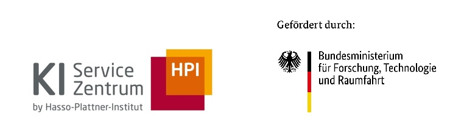

  

 

  
  
  
  

# AI Service Centre Berlin-Brandenburg

**Making artificial intelligence accessible for business, public administration, and society.**

The AI Service Centre Berlin-Brandenburg (KI-Servicezentrum Berlin-Brandenburg) is a project at the Hasso Plattner Institute (HPI) in Potsdam and one of four AI service centres funded by the German [Federal Ministry of Research, Technology and Space (BMFTR)](https://www.bmftr.bund.de/EN). We help companies, public administration, and startups put AI into practice through advisory services, hands-on training, and access to our AI compute infrastructure. All of our offerings are free of charge.

This organization hosts the open source side of that work: workshop materials, prototypes from pilot projects with our partners, demos, and reusable tools.

## What you'll find here

| Prefix | What it is | Examples |
|---|---|---|
| `workshop-` | Hands-on materials from our workshop series | [getting-started](https://github.com/aihpi/workshop-getting-started), [rag](https://github.com/aihpi/workshop-rag), [time-series](https://github.com/aihpi/workshop-time-series) |
| `pilotproject-` | Prototypes built together with partner organizations | [sentra](https://github.com/aihpi/pilotproject-sentra), [leichte-sprache](https://github.com/aihpi/pilotproject-leichte-sprache) |
| `demo-` | Self-contained demos of AI capabilities | [sketch2image](https://github.com/aihpi/demo-sketch2image) |
| `tool-` | Reusable tools and services | [litellm](https://github.com/aihpi/tool-litellm), [interactive-slurm](https://github.com/aihpi/tool-interactive-slurm) |

## Start here

- **Attending one of our workshops?** [workshop-getting-started](https://github.com/aihpi/workshop-getting-started) walks you through the setup you'll need.
- **Just browsing?** Our most popular materials cover [retrieval-augmented generation](https://github.com/aihpi/workshop-rag) and [agentic RAG](https://github.com/aihpi/workshop-agentic-rag), [reinforcement learning](https://github.com/aihpi/workshop-rl1-introduction), and [time series forecasting](https://github.com/aihpi/workshop-time-series).
- **Curious what we build with partners?** Explore the results of our research and pilot projects in the [virtual showroom](https://showroom.aisc.hpi.de).
- **Want to join live?** Upcoming workshops and guest talks are on [Eventbrite](https://www.eventbrite.de/o/ai-services-berlin-brandenburg-hpi-77903452433).

## Work with us

All offerings are free of charge and aimed at SMEs, public administration, and startups:

- **AI office hours (KI-Sprechstunde):** online group advisory sessions on use cases, model and framework selection, implementation, and efficient use of our infrastructure.
- **Pilot projects:** we develop a working AI prototype together with your organization, with active support from our AI engineers. Application rounds open every three months and are announced in our newsletter.
- **Infrastructure:** heterogeneous AI compute in Potsdam, from NVIDIA H100 training pods to a neuromorphic SpiNNaker cluster, available for training and evaluating your models.

Find out more on our website in [English](https://hpi.de/en/ai-service-centre/) or [German](https://hpi.de/ki-servicezentrum/).

## Stay in touch

- [Newsletter](https://hpi.de/registrierung/ai-service-center-newsletter/) for events and application rounds
- [LinkedIn](https://www.linkedin.com/showcase/ai-hpi/)
- Guest talk recordings on [tele-TASK](https://www.tele-task.de/series/1463/)
- Self-paced online courses on [openHPI](https://open.hpi.de) and [KI-Campus](https://ki-campus.org)
- Email us at [KISZ@hpi.de](mailto:KISZ@hpi.de)

---

The AI Service Centre Berlin-Brandenburg is funded by the German [Federal Ministry of Research, Technology and Space (BMFTR)](https://www.bmftr.bund.de/EN) under the funding code 16IS22092.
